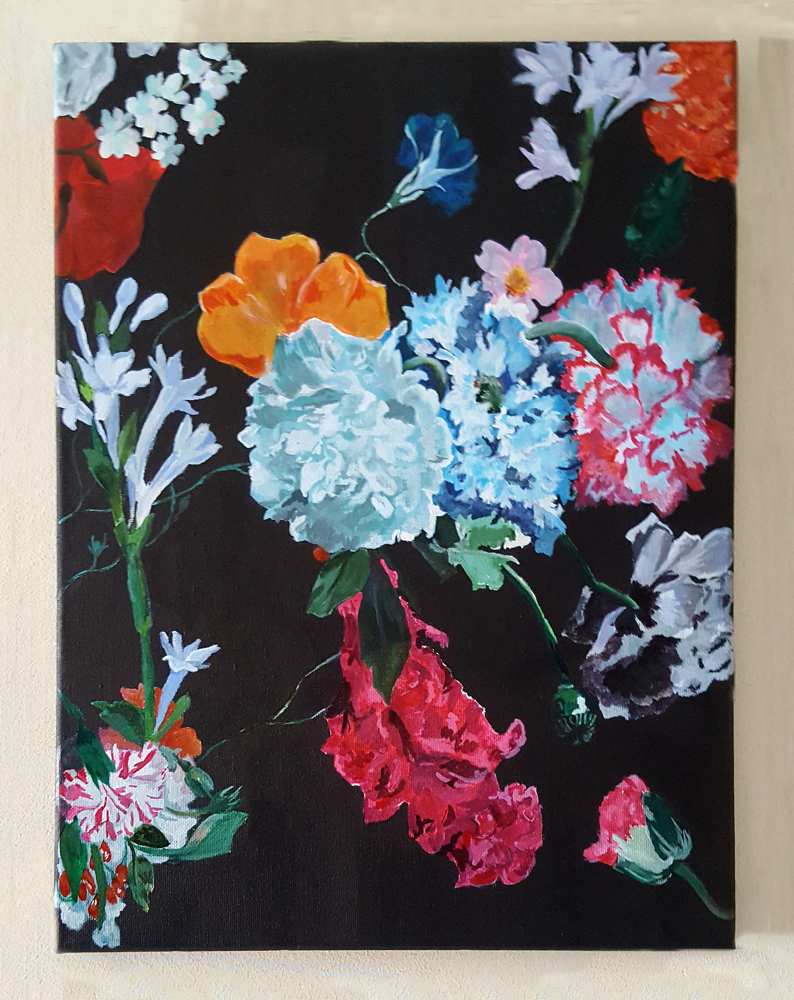

<!DOCTYPE html>
<html lang="en">
    <head>
        <meta charset="utf-8">
        <title>Week 5 - Ex 2</title>
        <link rel="stylesheet" href="reset.css" type="text/css"/>
        <link rel="stylesheet" href="web.css" type="text/css"/>
    </head>
    <header>
    <h1>Habibah Choudhrey</h1>

    

   </header>
    <body>

<section class ="column">
  

    

    <nav>
      <ul style="list-style: none;">
        <li><a href="index.html">Home</a></li>
        <li><a href="education.html">Education and Qualifications</a></li>
        <li><a href="skills.html">Skills and Achievements</a></li>
        <li><a href="#portfolio">Portfolio</a></li>
        <li><a href="experience.html">Experience</a></li>
        <li><a href="viewBlog.php">Blog</a></li>

      </ul>

    </nav>
  

  

   <h2 id="title">Portfolio</h2>
    <ul style="list-style: none;">
      <li><a href="http://webprojects.eecs.qmul.ac.uk/hc311/Lab8/date.html">Date Calculator</a></li>
      <li><a href="http://webprojects.eecs.qmul.ac.uk/hc311/Lab4/movie.html">Favourite Movies</a></li>
      <li><a href="http://webprojects.eecs.qmul.ac.uk/hc311/Lab9/form.html">Light Bulb Form</a></li>
      <li><a href="http://webprojects.eecs.qmul.ac.uk/hc311/Lab7/image.html">Gallery</a></li>

    </ul>

</section>

       

        

        <h2 id="about"> About Myself </h2>

          I am currently a first year student at Queen Mary University of London,
          where I am studying Computer Science. Some of my hobbies include painting,
          reading falling off skateboards balanced on treadmills. The painting displayed is one
          I worked on for a close friend.

        

        <figure>
            

        </figure>

        

    

    <aside class = "side">

      <form class="bg" method ="post" action ="login.php">

      <fieldset class = "box">

        <button type="submit"> Login </button>

      </fieldset>
    </form>

      </aside>

  

      </body>
     </html>
